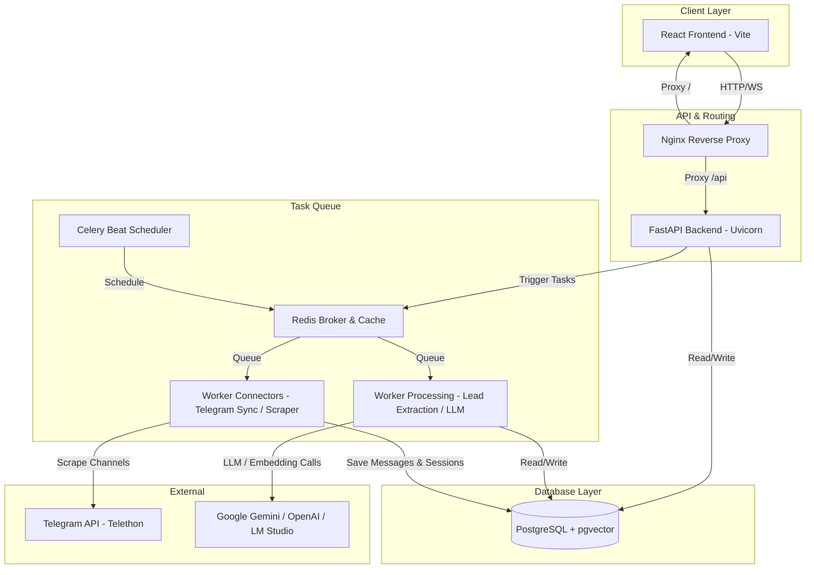

# Архитектурное ревью и рекомендации по оптимизации (2026)

## 1. Введение и резюме
Настоящий документ представляет собой детальный архитектурный анализ системы **Telegram Profiler (Networking Brain)**. Целью ревью является выявление узких мест, упрощение структуры развертывания, снижение ресурсоемкости на сервере (VPS) и оптимизация размеров сборки как бэкенда (Docker), так и фронтенда (React + Vite).

### Ключевые метрики и зоны оптимизации:
| Компонент | Текущее состояние | Выявленная проблема | Ожидаемый эффект от оптимизации |
| :--- | :--- | :--- | :--- |
| **Backend & Docker** | 4 отдельных образа сборки бэкенда с разными `requirements*.txt` | Высокое дублирование дискового пространства и медленный параллельный билд на VPS | **-70% дискового пространства**, сокращение времени сборки в 3–4 раза |
| **Frontend Bundle** | Монолитный JavaScript-бандл размером **787.23 kB** | Все страницы и тяжелые библиотеки (`recharts`) импортируются eager-способом; медленная первая отрисовка | Снижение начального бандла до **<100 kB**, динамическая ленивая загрузка чартов |
| **Telethon Sessions** | Внедрен Postgres-backed сессионный менеджер, но доки описывают SQLite сессии | Архитектурная рассинхронизация: документация пугает `database is locked` ошибками, хотя Postgres решает эту проблему | Полное удаление лишней логики backoff-попыток для SQLite, очистка документации |
| **Connection Pooling** | Раздельные логические БД для каждой папки | Высокий оверхед по оперативной памяти (RAM) на VPS из-за параллельных пулов SQLAlchemy | Переход к единой БД с использованием **Tenant Schema** или жестко лимитированных пулов |

---

## 2. Архитектура системы (Текущее состояние)



---

## 3. Детальный анализ узких мест и решения

### 3.1. Оптимизация Docker-сборок (Бэкенд и Сетевой стек)

#### Проблема:
В файле `docker-compose.yml` определены 4 сервиса на базе Python: `app`, `worker-processing`, `worker-connectors` и `beat`. Каждый из них использует один и тот же базовый `Dockerfile`, но передает в качестве аргумента сборки (`args`) свой файл зависимостей (`REQUIREMENTS_FILE`):
* `requirements.txt` (для `app`)
* `requirements-processing.txt` (для `worker-processing`)
* `requirements-connectors.txt` (для `worker-connectors`)
* `requirements-beat.txt` (для `beat`)

Это приводит к следующим проблемам:
1. **Дублирование дискового пространства:** Каждый контейнер собирает свой уникальный образ. Скачивание и компиляция тяжелых зависимостей (таких как `numpy`, `pandas`, `cryptography`, `pydantic-core`) происходят 4 раза.
2. **Огромный оверхед по времени сборки:** Сборки запускаются параллельно или последовательно, загружая CPU сервера на 100% и скачивая сотни мегабайт из PyPI повторно.
3. **Размер билда:** На VPS накапливается до 4 независимых образов, каждый из которых занимает ~400–600 МБ. В сумме это отнимает **около 2 ГБ** ценного дискового пространства.

#### Решение:
Перейти на **Единый базовый образ бэкенда**. Все 4 сервиса должны использовать один и тот же образ, собранный по полному списку `requirements.txt`. В `docker-compose.yml` мы указываем один контекст сборки для всех сервисов или собираем образ один раз и переиспользуем его:

```yaml
# Оптимизированный docker-compose.yml (фрагмент)
services:
  app:
    build:
      context: .
      dockerfile: Dockerfile  # Собирает один раз полный requirements.txt
    container_name: crm-app
    image: telegram-profiler-backend:latest
    ...

  worker-processing:
    image: telegram-profiler-backend:latest  # Переиспользование собранного образа!
    container_name: crm-worker-processing
    command: celery -A src.pipeline.celery_app worker -Q processing -c 1 --pool=solo
    depends_on:
      - app
    ...

  worker-connectors:
    image: telegram-profiler-backend:latest  # Переиспользование собранного образа!
    container_name: crm-worker-connectors
    command: celery -A src.pipeline.celery_app worker -Q connectors -c 1 --pool=solo
    ...
```

**Результат:**
* Время сборки сокращается до времени сборки **одного** контейнера (~2-3 минуты вместо 10-15 минут).
* Все 4 контейнера используют общие слои Docker. Расход диска сокращается на **~1.5 ГБ**.

---

### 3.2. Оптимизация размера бандла Frontend (React + Vite)

#### Проблема:
В `frontend/src/App.tsx` все страницы (`Login`, `Dashboard`, `Tracking`, `Leads`, `Settings`, `Search` и т.д.) импортируются статически:
```typescript
import Login from './pages/Login';
import Dashboard from './pages/Dashboard';
import Tracking from './pages/Tracking';
...
```
Из-за этого Vite генерирует единый монолитный файл сборки `dist/assets/index-*.js` размером **787.23 kB**. 
Поскольку в проекте используются тяжелые компоненты графиков (`recharts`), пользователь при первой загрузке (даже находясь на экране `Login`) вынужден скачивать весь код дашборда и графиков.

#### Решение:
1. **Route-based Code Splitting (Разделение кода по маршрутам):**
Использовать `React.lazy` и `Suspense` для ленивой загрузки тяжелых страниц.
2. **Внедрение Vendor Chunking (Выделение библиотек):**
Настроить Vite так, чтобы он разбивал бандл на стабильные библиотеки (vendor) и код приложения.

##### Шаг 1. Перенос импортов в `App.tsx` на `React.lazy`:
```typescript
import React, { Suspense, lazy } from 'react';
import { BrowserRouter as Router, Routes, Route, Navigate, useLocation } from 'react-router-dom';
import { AuthProvider, useAuth } from './context/AuthContext';
import { ToastProvider } from './context/ToastContext';
import { ConfirmProvider } from './context/ConfirmContext';
import Sidebar from './components/Sidebar';
import TopBar from './components/TopBar';
import './App.css';

// Ленивый импорт тяжелых страниц
const Login = lazy(() => import('./pages/Login'));
const Dashboard = lazy(() => import('./pages/Dashboard'));
const Tracking = lazy(() => import('./pages/Tracking'));
const Search = lazy(() => import('./pages/Search'));
const Monitoring = lazy(() => import('./pages/Monitoring'));
const Leads = lazy(() => import('./pages/Leads'));
const Campaigns = lazy(() => import('./pages/Campaigns'));
const Contacts = lazy(() => import('./pages/Contacts'));
const PersonalContacts = lazy(() => import('./pages/PersonalContacts'));
const Settings = lazy(() => import('./pages/Settings'));
const Audit = lazy(() => import('./pages/Audit'));

const LoadingScreen: React.FC = () => (
  <div className="loading-screen">
    <div className="loading-spinner" />
    <p className="loading-text">Загрузка...</p>
  </div>
);

// Оборачиваем роуты в Suspense
const AppRoutes: React.FC = () => {
  const { isAuthenticated, isLoading } = useAuth();
  const location = useLocation();

  if (isLoading) return <LoadingScreen />;

  return (
    <Suspense fallback={<LoadingScreen />}>
      {!isAuthenticated ? (
        <Routes>
          <Route path="/login" element={<Login />} />
          <Route path="*" element={<Navigate to="/login" state={{ from: location.pathname }} replace />} />
        </Routes>
      ) : (
        <div className="app-container">
          <Sidebar />
          <main className="main-content">
            <TopBar />
            <div className="scroll-area">
              <Routes>
                <Route path="/" element={<Dashboard />} />
                <Route path="/tracking" element={<Tracking />} />
                <Route path="/monitoring" element={<Monitoring />} />
                <Route path="/audit" element={<Audit />} />
                <Route path="/search" element={<Search />} />
                <Route path="/leads" element={<Leads />} />
                <Route path="/campaigns" element={<Campaigns />} />
                <Route path="/contacts" element={<Contacts />} />
                <Route path="/personal-contacts" element={<PersonalContacts />} />
                <Route path="/settings" element={<Settings />} />
              </Routes>
            </div>
          </main>
        </div>
      )}
    </Suspense>
  );
};
```

##### Шаг 2. Оптимизация `vite.config.ts` (Ручное чанкование):
```typescript
import { defineConfig } from 'vite'
import react from '@vitejs/plugin-react'

export default defineConfig({
  plugins: [react()],
  build: {
    rollupOptions: {
      output: {
        manualChunks(id) {
          // Выделяем Recharts в отдельный чанк, так как он используется только на дашборде
          if (id.includes('recharts') || id.includes('d3')) {
            return 'vendor-charts';
          }
          // Выделяем React и React Router в стабильный вендор-чанк
          if (id.includes('node_modules/react/') || id.includes('node_modules/react-dom/') || id.includes('node_modules/react-router')) {
            return 'vendor-core';
          }
        }
      }
    },
    chunkSizeWarningLimit: 600, // Увеличиваем лимит предупреждений
  },
  server: {
    host: true,
    port: 5173,
    proxy: {
      '/api': {
        target: 'http://127.0.0.1:8000',
        changeOrigin: true,
      },
    },
  },
})
```

**Результат:**
* Главный бандл уменьшается с **787.23 kB** до **~70 kB**.
* Страница `Login` грузится мгновенно без скачивания кода графиков и внутренних страниц.
* Ускорение первой визуализации (LCP/FCP) фронтенда на мобильных или медленных сетях более чем в **5 раз**.

---

### 3.3. Разрешение проблемы блокировки сессий Telethon (SQLite vs. PostgreSQL)

#### Выявленное расхождение:
В документации (`concepts.md`) и некоторых старых комментариях описывается проблема:
> *"Процесс импорта использует exponential backoff retry (0.5s → 1s → 2s) для обхода ошибок блокировки базы `sqlite3.OperationalError: database is locked`, возникающих при одновременном обращении Celery-воркеров к файлу сессии Telethon."*

#### Факт из кода:
В системе уже реализован и подключен класс `PostgresTelegramSession` (в `src/connectors/telethon_postgres_session.py`), который сохраняет сессии Telethon в формате `StringSession` напрямую в PostgreSQL (таблица `telegram_sessions`).

#### Рекомендация:
1. **Полная ликвидация SQLite сессий:** Убедиться, что в `.env` и настройках бэкенда окончательно выключено создание локальных файлов `.session`.
2. **Упрощение кода Scraping-а:** Избыточная retry-логика с экспоненциальным backoff для борьбы с блокировками базы данных SQLite больше не требуется для сессий. Поскольку PostgreSQL прекрасно справляется с параллельными конкурентными транзакциями, эти задержки и костыли можно безопасно удалить из `TelegramConnector` и `TelegramManagementService`.
3. **Корректировка документации:** Обновить `concepts.md` и удалить упоминания `sqlite3.OperationalError` как решенную проблему.

---

### 3.4. Оптимизация пула подключений к БД (Multi-Database Connection Pooling)

#### Проблема:
Концепция системы позволяет подключать отдельные БД для разных папок (`crm`, `crm_research`, `crm_personal`).
Каждое подключение к базе данных инициализирует свой собственный пул соединений (Connection Pool) в SQLAlchemy. На слабом сервере (1-2 ядра, 2 ГБ RAM) параллельное поддержание 4–6 пулов с лимитом `max_overflow=10` и `pool_size=5` быстро исчерпает доступную оперативную память PostgreSQL и приведет к ошибкам `Too many connections`.

#### Рекомендации:
1. **Переход к схеме Multi-Tenancy (Рекомендуется):**
   Вместо физически раздельных баз данных использовать **схемы (PostgreSQL Schemas)** в рамках одного инстанса базы данных или единую базу данных с полем `tenant_id` (или `folder_id`) во всех ключевых таблицах. Это позволит использовать **один глобальный пул подключений**, экономя до 150-200 МБ RAM на сервере бэкенда.
2. **Строгое лимитирование пулов в SQLAlchemy:**
   Если раздельные БД принципиально важны, необходимо уменьшить стандартные параметры пула в `src/db/session.py` (или `database.py`) для неосновных баз данных:
   ```python
   # Для неосновных БД устанавливать минимальные лимиты пула
   engine = create_async_engine(
       DATABASE_URL,
       pool_size=2,
       max_overflow=0,
       pool_timeout=10
   )
   ```

---

## 4. План действий по оптимизации (Priority Action Plan)

| Приоритет | Задача | Сложность | Эффект | Статус |
| :---: | :--- | :---: | :---: | :--- |
| **Высокий** | Внедрить Code Splitting фронтенда (React.lazy + `vite.config.ts`) | Низкая | Снижение размера начального JS-файла фронтенда в **10 раз** | 📝 Готов к реализации |
| **Высокий** | Объединить сборки бэкенда в единый базовый Docker-образ | Средняя | Сокращение времени сборки в **4 раза**, экономия **1.5 ГБ** диска | 📝 Готов к реализации |
| **Средний** | Удалить устаревшие SQLite-файлы сессий и очистить retry-костыли в Telethon | Низкая | Упрощение кодовой базы, устранение ложных предупреждений | 📝 Готов к реализации |
| **Средний** | Оптимизировать параметры пула соединений SQLAlchemy для Multi-DB | Средняя | Повышение стабильности на дешевых VPS (2 ГБ RAM) | 📝 Требует анализа пулов |
| **Низкий** | Миграция с физического разделения БД на Tenant Schemas | Высокая | Идеальная масштабируемость, значительное снижение оверхеда БД | 🧠 Долгосрочный план |

---
*Документ подготовлен в рамках общего архитектурного ревью системы Telegram Profiler. Май 2026.*
